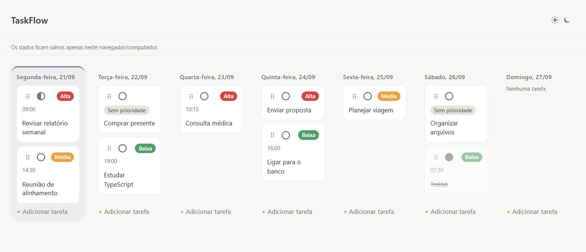
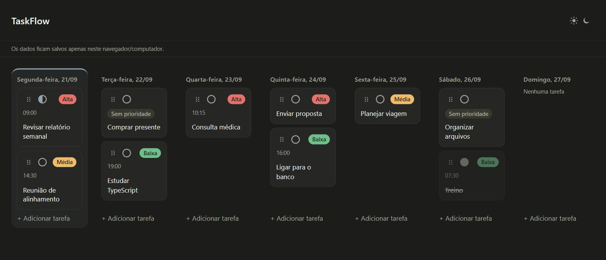

# TaskFlow

[](https://github.com/b3bel23/taskflow/actions/workflows/deploy.yml)

**🔗 Acesse o app: [b3bel23.github.io/taskflow](https://b3bel23.github.io/taskflow/)**

Um gerenciador semanal de tarefas simples e intuitivo, feito com **React** e **TypeScript**, desenvolvido com o **BMAD Method** e **Spec-Driven Development (SDD)** — da descoberta do problema até a implementação.

<p align="center">
  
</p>

<details>
<summary>Ver também no tema escuro</summary>

<p align="center">
  
</p>

</details>

> ✅ **Status do projeto:** concluído — 7 épicos e 17 histórias entregues, publicado no GitHub Pages. Os dados ficam só no navegador de quem usa.

## 📌 Sobre o projeto

O TaskFlow surgiu para resolver um problema simples: tarefas de trabalho, estudos e vida pessoal acabam espalhadas entre anotações, mensagens e vários aplicativos.

A ideia é oferecer uma **visão semanal única e centralizada**: você vê hoje e os próximos seis dias lado a lado e organiza tarefas por dia, horário, prioridade e estado de progresso, sem a complexidade de ferramentas de gerenciamento de projetos.

Além de ser uma aplicação funcional, o projeto é um estudo prático de desenvolvimento assistido por IA com **BMAD Method + Spec-Driven Development**: em vez de gerar a aplicação a partir de um prompt, ele passou por brief, PRD, UX, arquitetura, especificações e épicos antes de qualquer código.

## ✨ Funcionalidades

* 📅 **Janela de 7 dias a partir de hoje** — a primeira coluna é sempre hoje, seguida dos 6 dias seguintes, cada um com o nome do dia e a data. A janela avança sozinha quando o dia vira, mesmo com a aba aberta.
* ↩️ **Rollover automático** — tarefas não concluídas de dias que já passaram voltam sozinhas para hoje. Tarefas concluídas ficam onde estão.
* ➕ **Criar, editar e excluir** tarefas (a exclusão pede confirmação).
* 🕘 **Horário opcional** — as tarefas do dia aparecem em ordem cronológica: primeiro as sem horário, depois as com horário, do mais cedo ao mais tarde. O horário aparece no cartão.
* 🚦 **Prioridade visual** — a tag (Alta, Média, Baixa ou Sem prioridade) fica sempre visível no cartão; clicar nela alterna o nível sem abrir o formulário. A prioridade é só um rótulo e não muda a ordem das tarefas.
* ✅ **Estado de progresso** — Pendente, Em andamento e Concluída, alternados clicando no indicador circular do cartão. Tarefas concluídas ficam riscadas e esmaecidas.
* 🖱️ **Arrastar e soltar entre dias** — arraste um cartão para a coluna de outro dia para mudar a data. Pelo teclado: foco na alça de arraste, `Espaço` para pegar, setas para escolher o dia e `Espaço` para soltar (`Esc` cancela). A data também pode ser mudada pelo formulário de edição.
* 💾 **Persistência local** com `localStorage`, incluindo migração automática de dados salvos no formato antigo (por dia da semana) para o formato atual (por data). Com duas abas abertas, as alterações de uma aparecem na outra sem recarregar.
* 📱 **Layout responsivo** — 7 colunas em telas largas, 4 em tablets e 1 coluna no celular, com os dias empilhados (hoje primeiro) e áreas de toque maiores nos controles.
* 🌙 **Tema claro e escuro.**
* ♿ **Acessível por teclado**, com foco visível e rótulos para leitores de tela.

O app não tem cadastro nem login e funciona 100% no navegador, sem backend.

## 🛠️ Tecnologias

| Área | Tecnologia |
|---|---|
| Interface | React 19, TypeScript 6 |
| Build | Vite 8 |
| Estado | React Context + `useReducer` |
| Arrastar e soltar | `@dnd-kit/core` |
| Estilo | CSS Modules + CSS Custom Properties (tokens de design) |
| Persistência | `localStorage` |
| Testes | Vitest 5, Testing Library, jsdom (unitários) · Playwright (E2E em navegador real) |
| Deploy | GitHub Actions + GitHub Pages |

## 🏗️ Arquitetura

Simples e proporcional ao escopo — sem Redux, sem banco externo e sem API.

```text
src/
├── components/   Interface: WeekView, DayColumn, TaskCard, TaskModal,
│                 PriorityTag, StateIndicator, ThemeToggle, Header…
├── state/        Contextos, reducers e ações (useTaskActions), além de
│                 funções puras: seletores e regra de rollover
├── storage/      Único lugar que toca o localStorage (tarefas e tema)
├── constants/    Datas: janela de 7 dias, formatação, conversão ISO
├── types/        Tipos compartilhados (Task, Priority, TaskState…)
└── styles/       Tokens de design (cores, espaçamento, tipografia)
e2e/              Testes de ponta a ponta (Playwright)
```

Decisões principais:

* **Persistência atômica:** toda mudança de tarefa é salva *antes* de ser aplicada ao estado. Se a escrita falhar, a tela não muda e o erro é tratado, sem perder consistência.
* **Camadas verificadas por teste:** só `src/storage/` acessa `localStorage`, e só o `ThemeContext` escreve o atributo de tema — regras conferidas por `architecture.test.ts`, que lê o código como AST (comentários não contam; atalhos como `window['local' + 'Storage']` são detectados).
* **Funções puras** para ordenação por horário, renumeração de ordem e rollover, isoladas e cobertas por testes.
* **Várias abas:** o adaptador de storage escuta o evento `storage` do navegador, então uma aba adota o que a outra salvou (um valor corrompido escrito por outra aba nunca apaga o que já está na tela). Edição simultânea do **mesmo** item em duas abas: vale a última gravação.
* **Só grava o que consegue ler de volta:** horário fora de `HH:mm` é recusado na escrita, porque a leitura rejeitaria o dado no próximo carregamento.
* **Datas em horário local** (`YYYY-MM-DD`), nunca via UTC, para evitar o clássico erro de "um dia a menos" em fusos negativos.
* Chaves de armazenamento independentes:

```text
taskflow:tasks   (envelope { schemaVersion: 2, tasks: [...] })
taskflow:theme
```

## 🧪 Testes

**Unitários e de componentes** — cerca de 400 testes (Vitest + Testing Library) cobrindo estado, armazenamento, componentes e a integração da semana: rollover, migração de dados, virada de dia com relógio simulado, ordenação por horário, persistência com falha de escrita, sincronização entre abas e as regras de arquitetura (checadas por análise da AST do código).

**Ponta a ponta (E2E)** — 60 testes em Chrome real (Playwright) contra o app buildado, com fuso e relógio fixos: janela de 7 dias e sua virada de dia, rollover, migração v1→v2, dados corrompidos, criar/editar/excluir, estado e prioridade, foco do modal, falha de escrita, persistência, duas abas, arraste com mouse e por teclado (inclusive interrompido por `Esc`, `pointercancel` e troca de aba), fusos e horário de verão, e o layout responsivo.

```bash
npm run test        # unitários (Vitest)
npm run test:e2e    # E2E (Playwright): faz o build e sobe o app sozinho
npm run build       # checagem de tipos (tsc, inclui os testes E2E) + build de produção
```

Na primeira vez, o E2E precisa de um navegador: `npx playwright install chromium`. Se você já tem o Google Chrome, dá para usá-lo sem baixar nada com `PW_CHANNEL=chrome npm run test:e2e` (PowerShell: `$env:PW_CHANNEL='chrome'; npm run test:e2e`).

> Dica: em pastas sincronizadas (como OneDrive), o Vitest pode perder arquivos por timeout de worker. Use `npx vitest run --maxWorkers=1` e confira a contagem de arquivos e testes.

**Não coberto por teste automatizado:** o gesto de arrastar com o **dedo** numa tela de toque real e o uso com leitor de tela — só verificação manual em aparelho.

## 🚀 Executando localmente

Requer **Node.js 22.12 ou superior** (exigência do Vite 8 e do Vitest 5).

```bash
git clone https://github.com/b3bel23/taskflow.git
cd taskflow
npm install
npm run dev
```

O app abre em `http://localhost:5173/taskflow/`.

## 🌐 Deploy (GitHub Pages)

O site é publicado automaticamente: a cada `push` na branch `main`, o workflow [`deploy.yml`](.github/workflows/deploy.yml) roda os testes unitários (`npm run test`), o build (`npm run build`) e os testes E2E; **só se tudo passar** a pasta `dist` é publicada no GitHub Pages. Se qualquer etapa falhar, nada é publicado. O `base` do Vite está configurado como `/taskflow/`, o subcaminho do repositório.

Para publicar seu próprio fork: em **Settings → Pages**, escolha **Source: GitHub Actions** e faça um push na `main`.

## 🧠 Processo de desenvolvimento

O TaskFlow seguiu um fluxo estruturado de **BMAD Method + SDD**. A implementação só começou depois de o problema, os requisitos, a experiência do usuário e a arquitetura terem sido definidos e validados:

```text
Product Brief → PRD → UX Design → Arquitetura → Épicos e Histórias
              → Sprint Planning → Implementação (história por história)
              → Code review → Retrospectiva
```

Um resumo curto do que o app deve fazer está em [`REQUIREMENTS.md`](REQUIREMENTS.md). Toda a documentação está versionada em [`_bmad-output/`](_bmad-output/):

* [Brief](_bmad-output/planning-artifacts/briefs), [PRD](_bmad-output/planning-artifacts/prds), [UX](_bmad-output/planning-artifacts/ux-designs) e [Arquitetura](_bmad-output/planning-artifacts/architecture)
* [Épicos e histórias](_bmad-output/planning-artifacts/epics.md) com critérios de aceite
* [Proposta de mudança de curso](_bmad-output/planning-artifacts/sprint-change-proposal-2026-09-18.md) — o pivô de "semana fixa Seg→Dom" para "janela dinâmica a partir de hoje", com horário e prioridade visual
* [Especificações e retrospectivas](_bmad-output/implementation-artifacts/) por épico, inclusive a [retrospectiva dos Épicos 5 a 7](_bmad-output/implementation-artifacts/epic-5-retro-2026-09-19.md)
* [`sprint-status.yaml`](_bmad-output/implementation-artifacts/sprint-status.yaml) com o andamento de todas as histórias

### Épicos entregues

| Épico | Tema |
|---|---|
| 1 | Fundação: semana, persistência e tema claro/escuro |
| 2 | Gerenciamento de tarefas: criar, editar e excluir |
| 3 | Progresso: estado da tarefa e destaque das concluídas |
| 4 | Mover tarefa entre dias por arraste (mouse e teclado) |
| 5 | Data real, janela dinâmica, migração de dados e rollover |
| 6 | Organização por horário |
| 7 | Prioridade como atributo visual (tag clicável) |

## 🔮 Limitações e possibilidades futuras

* Os dados ficam **só no navegador e no computador** onde foram criados — não há sincronização entre dispositivos nem backup.
* O layout responsivo foi verificado em larguras emuladas no navegador (360 a 1280px), mas **ainda não em aparelhos reais**; em especial, o arraste por toque não foi testado num celular de verdade.
* Não há desfazer nem exportação/backup dos dados (decisão de produto: o aviso na tela é a mitigação).
* Anúncios de leitor de tela do arraste ainda usam o texto padrão da biblioteca (em inglês).
* Fora do escopo por enquanto: cadastro e login, sincronização, notificações e lembretes.

Mesmo em versões futuras, a proposta é continuar focado em **organização pessoal**, e não virar uma ferramenta de gerenciamento de equipes.

## 📄 Licença

Distribuído sob a licença **MIT** — veja o arquivo [`LICENSE`](LICENSE).

---

Desenvolvido como um projeto prático utilizando **BMAD Method + Spec-Driven Development (SDD)**.
