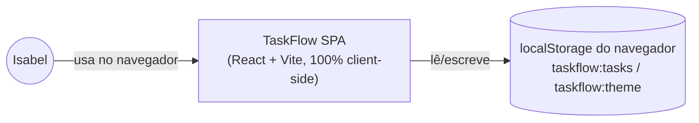
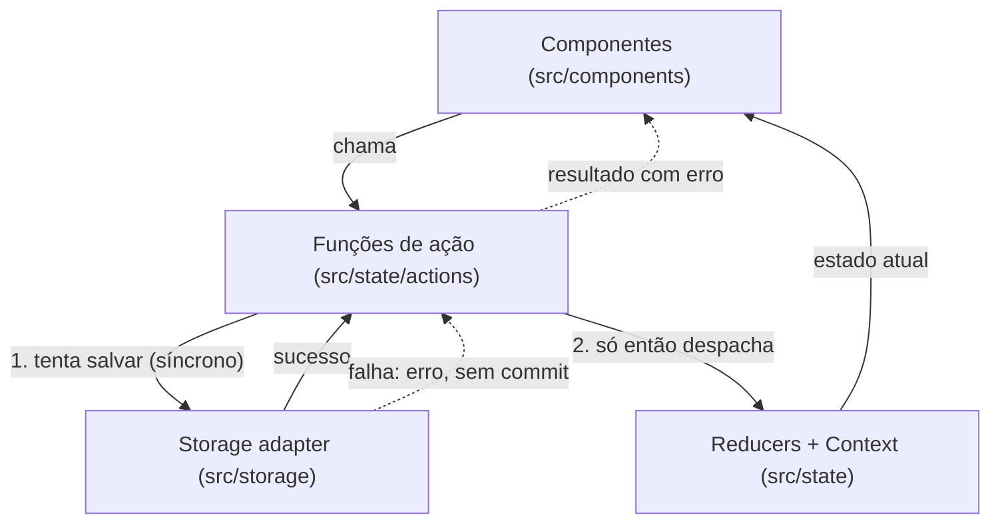
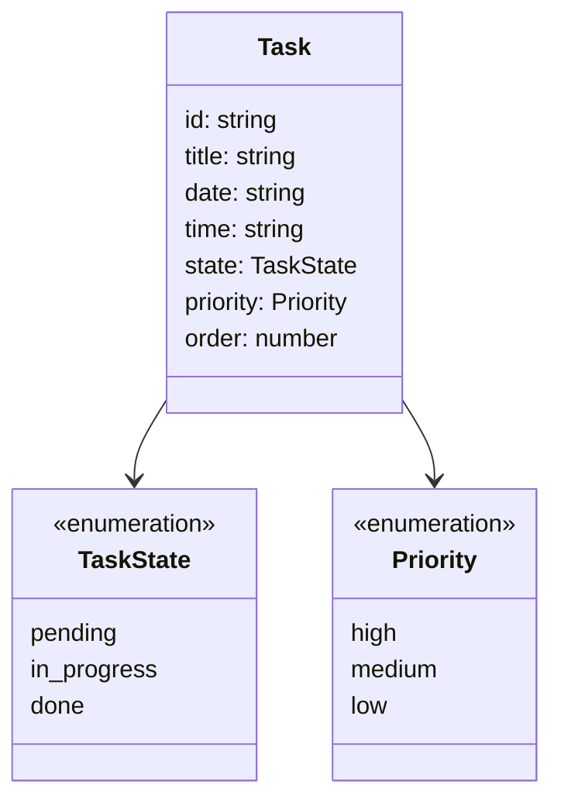

# Architecture Spine — TaskFlow

## Design Paradigm

TaskFlow é uma SPA (Single Page Application) **100% client-side** — sem backend, sem servidor, sem infraestrutura própria. Roda inteira no navegador de Isabel; o único "armazenamento remoto" é o `localStorage` do próprio navegador.

Dentro do cliente, o fluxo de dados é **unidirecional estilo Flux** (Ação → Reducer → Estado → View), com uma variação deliberada: as ações não são despachadas cruamente pelos componentes. Elas passam por uma **camada de comandos guardada por persistência** — funções de ação (`useTaskActions`, `useThemeActions`) que primeiro tentam persistir a mudança em `localStorage` e só então committam o novo estado ao React. Isso torna a consistência entre estado em memória e dados salvos uma propriedade estrutural, não uma convenção que cada tela precisa lembrar de seguir (ver AD-4).

Mapeamento de camadas → diretórios:

| Camada | Papel | Diretório |
| --- | --- | --- |
| UI (View) | Renderiza estado, chama funções de ação, nunca muta estado nem toca storage diretamente | `src/components/` |
| Comandos (Action layer) | Funções que validam, tentam persistir, e só então committam ao estado; único ponto que decide "sucesso ou erro" de uma mutação | `src/state/actions/` |
| Estado (Domain) | Reducers puros + Contexts (`TaskContext`, `ThemeContext`); fonte única de verdade em memória | `src/state/` |
| Persistência (Storage adapter) | Único código que toca `window.localStorage`; serialização, schema version, tratamento de erro de escrita | `src/storage/` |



## Invariants & Rules

### AD-1 — Sem backend, sem infraestrutura própria [ADOPTED]

- **Binds:** all
- **Prevents:** introduzir servidor, API própria, banco de dados remoto, CI/CD ou provedor de nuvem sem necessidade concreta do MVP.
- **Rule:** todo o comportamento do MVP é implementado no cliente (navegador). Nenhum FR do MVP exige um servidor — se uma história futura parecer exigir um, isso é um sinal de escopo saindo do MVP definido no PRD, e deve ser discutido antes de implementado, não decidido silenciosamente na hora de codar.

### AD-2 — Persistência via `localStorage`, duas chaves independentes

- **Binds:** NFR persistência (PRD §5), tema (EXPERIENCE.md Foundation)
- **Prevents:** um mecanismo de storage por feature (ex. tarefas em IndexedDB e tema em cookie), uma única chave acoplando dois domínios que mudam por gatilhos diferentes, ou dois módulos assumindo formatos diferentes para a mesma chave.
- **Rule:** tarefas e tema são domínios de persistência independentes, cada um com sua própria chave e seu próprio formato — nunca misturados:
  - `taskflow:tasks` — sempre `JSON.stringify`/`JSON.parse` de `{ schemaVersion: number, tasks: Task[] }`. Só `loadTasks`/`saveTasks` tocam essa chave.
  - `taskflow:theme` — sempre uma **string crua** (`'light'` ou `'dark'`), nunca `JSON.stringify`/`JSON.parse`. Só `loadTheme`/`saveTheme` tocam essa chave.
  - `schemaVersion` existe para permitir migração futura do formato salvo sem precisar redesenhar a persistência. **Esta cláusula deixou de ser apenas teórica em 2026-09-18** — ver exceção de migração abaixo.
  - **Carregamento inicial (`loadTasks`/`loadTheme`):** chave ausente (primeira instalação) → estado vazio padrão (`{ schemaVersion: CURRENT, tasks: [] }` / `'light'`), sem erro. Chave presente mas ilegível (`getItem` lança, `JSON.parse` falha, ou `schemaVersion` não reconhecido **e diferente de qualquer versão migrável conhecida** — ver exceção abaixo) → cai no estado vazio padrão, mas sinaliza um `loadError` que a UI mostra **uma vez**, na abertura ("Não foi possível carregar as tarefas salvas — começando do zero."), distinto do aviso permanente do AD-3. Nunca lança exceção não tratada na inicialização do app.
  - Tema padrão no primeiro uso (chave ausente) é sempre `'light'` — nunca derivado de `prefers-color-scheme` (EXPERIENCE.md proíbe seguir o SO).
  - **Exceção de migração (2026-09-18, `CURRENT_SCHEMA_VERSION` passa de `1` para `2`):** `schemaVersion === 1` (formato anterior, `Task.day: DayOfWeek`) **não** cai no caminho de `loadError`/descarte. `loadTasks` detecta essa versão e executa `migrateFromV1` (função pura e dedicada, não misturada com a validação de formato atual) antes de qualquer outra coisa: cada tarefa tem seu `day` (`'mon'..'sun'`) remapeado para a `date` (ISO `YYYY-MM-DD`) correspondente àquele dia-da-semana **dentro da primeira janela dinâmica calculada** (hoje..hoje+6) — nunca para uma data já passada, evitando que a própria migração dispare rollover (AD-11) na mesma hora. Após a migração, os `order` de cada `date` são renumerados sequencialmente (fecham-se os buracos que existiam por `(day, priorityGroup)`), o resultado é imediatamente regravado como `schemaVersion: 2`, e o carregamento segue como sucesso normal (**sem** `loadError`). Só um `schemaVersion` fora de `{1, 2}` continua no caminho de descarte original — não há um terceiro formato histórico a preservar. Esta é a única exceção a "schemaVersion não reconhecido = dado corrompido" em todo o AD-2, e existe especificamente para cumprir "migração de dados existentes sem perda" (PRD FR-1/FR-2, `sprint-change-proposal-2026-09-18.md` §7.3).

### AD-3 — Mitigação do risco de perda de dados: aviso, não backup

- **Binds:** NFR persistência (PRD §5, Open Question 5)
- **Prevents:** adicionar uma funcionalidade de exportar/importar dados não pedida no PRD, ou ignorar o risco silenciosamente sem tratar.
- **Rule:** a interface exibe um aviso estático e discreto informando que os dados ficam salvos apenas neste navegador/computador. Nenhum mecanismo de backup/exportação é implementado no MVP — decisão explícita de Isabel, revisitável se o uso real mostrar perda de dados recorrente (ver Deferred).

### AD-4 — Persistência e commit de estado são atômicos

- **Binds:** FR-1, FR-2, FR-3, FR-4, FR-6, FR-8, FR-9 (**toda** mutação de tarefa — criar, editar, excluir, mudar estado, ciclar prioridade, mudar dia por arraste **ou** pelo Modal, rollover automático (AD-11) e migração de schema (AD-2) — sem exceção de caminho, inclusive as duas últimas que não nascem de um clique de Isabel); tema
- **Prevents:** estado em memória e dados salvos divergirem; retry silencioso escondendo falhas; perda do que a usuária digitou quando salvar falha; um caminho de mutação (ex. arraste) contornando o guard porque só CRUD-via-modal foi lembrado.
- **Rule:** uma função de ação (`useTaskActions`/`useThemeActions`) primeiro tenta a escrita síncrona em `localStorage` (`try/catch`). Só em caso de sucesso ela despacha a mudança para o reducer/Context. Em caso de falha, o estado React **não muda**, e a função de ação retorna um resultado de erro para quem a chamou. No Modal de Tarefa, isso significa: o modal continua aberto, mostra uma mensagem de erro inline, preserva os campos já preenchidos, e oferece tentar novamente ou cancelar — nunca uma nova tentativa automática e silenciosa. **Nenhum outro caminho de mutação chama o reducer diretamente** — o drop handler do drag-and-drop chama a mesma `useTaskActions.moveTaskToDate` que o Modal chamaria (nunca um `dispatch` próprio), e o efeito de rollover automático (AD-11) chama `useTaskActions.applyRollover` (escrita em lote, uma única chamada de `saveTasks` para todas as tarefas afetadas, nunca N chamadas individuais).
  - **Formato de retorno único, sem exceções para a UI:** toda função de `useTaskActions`/`useThemeActions` retorna sempre `{ ok: true, task }` (ou `{ ok: true }`) em sucesso, ou `{ ok: false, error: { message: string } }` em falha — nunca lança (`throw`) para quem chamou. O `try/catch` da escrita fica interno à função de ação/ao storage adapter. Toda UI trata o resultado por essa forma (`if (!result.ok) ...`), nunca por `try/catch` ao redor da chamada.

### AD-5 — Gerenciamento de estado: React nativo, sem biblioteca externa

- **Binds:** all (estado da aplicação)
- **Prevents:** introduzir Redux/Zustand/outra lib de estado para um volume de dados (lista pessoal de uma usuária) que não justifica a camada extra.
- **Rule:** o estado vive em `useReducer` + `Context` do próprio React — um par (`tasksReducer`/`TaskContext`) para tarefas, outro (`themeReducer`/`ThemeContext`) para tema. Nenhuma dependência de state management externa entra no MVP sem justificativa concreta revisitada nesta spine.

### AD-6 — Arraste (drag-and-drop) sempre com equivalente completo por teclado

- **Binds:** FR-6 (mudar dia), EXPERIENCE.md Accessibility Floor
- **Prevents:** duas implementações de interação divergentes (uma lógica para mouse via arraste, outra hand-rolled para teclado) que podem dessincronizar.
- **Rule (revisada 2026-09-18 — escopo reduzido):** o arraste passa a fazer **uma única coisa**: mover a Tarefa para outra coluna de dia (`date`), preservando Horário e Prioridade. Usa `@dnd-kit/react` (+ `@dnd-kit/dom`, `@dnd-kit/helpers`), cujo sensor de teclado embutido é a *mesma* lógica de interação usada pelo mouse — não uma reimplementação paralela. Como não há mais zonas de prioridade como alvo de drop (AD-7 obsoleto — ver abaixo), o drop target é sempre uma coluna de dia inteira, não uma sub-região dela; isso simplifica a superfície de drop em relação ao desenho original. O Modal de Tarefa continua sendo a via alternativa completa a qualquer mudança de Dia (EXPERIENCE.md Interaction Primitives), como caminho totalmente independente do drag-and-drop, mas ambos terminam na mesma função de ação `useTaskActions.moveTaskToDate` (AD-4).
- **Risco aceito:** `@dnd-kit/react` está em `0.5.0`, pré-1.0, com API ainda sujeita a mudanças segundo os próprios mantenedores. Aceito porque é a opção acessível (teclado nativo) mais madura disponível hoje; se uma quebra de API bloquear a implementação, fixar a versão exata (sem `^`) no `package.json` e reavaliar aqui antes de atualizar.

### AD-7 — [OBSOLETO 2026-09-18] Ordem manual dentro do mesmo nível de prioridade

- **Status:** revogado. Mantido aqui só como registro histórico — não implementar.
- **Motivo:** com a ordenação passando a ser por Horário (FR-6) e o drag passando a mover só entre dias (AD-6 revisado), deixam de existir "nível de prioridade" como escopo de ordenação e "reordenação manual dentro do dia" como capacidade — Prioridade virou puro atributo visual (FR-8), sem efeito posicional. `reorderWithinGroup` e `reorderGroupByIndex` (`src/state/selectors.ts`) ficam sem chamador e devem ser removidas, não mantidas como código morto.
- **Substituído por:** AD-10 (janela dinâmica) e a regra de ordenação por Horário em FR-6 — a posição de uma Tarefa dentro do dia volta a ser **sempre derivada** (Horário, com `order` só como desempate de criação — ver AD-10), nunca definida por gesto manual do usuário. `order` continua existindo como campo, mas seu escopo muda de `(day, priorityGroup)` para `(date)` — usado exclusivamente como critério de desempate estável quando duas Tarefas têm o mesmo Horário (ou ambas não têm), nunca mais como alvo de reordenação por arraste/Modal. `closeOrderGap` é mantida, com o mesmo ajuste de escopo (`(date)` em vez de `(day, priority)`), para reindexar sequencialmente após exclusão.

### AD-10 — Janela dinâmica de 7 dias ancorada em hoje

- **Binds:** FR-5, FR-9
- **Prevents:** tratar "os 7 dias" como um array estático de dias-da-semana (`DAYS_OF_WEEK`, hoje em `src/constants/days.ts`); esquecer de recalcular a janela quando o app fica aberto atravessando a virada do dia (risco já registrado em `epic-1-retro-item-24`, agora crítico porque afeta as 7 colunas inteiras, não só um destaque visual).
- **Rule:** a janela visível é sempre `[hoje, hoje+1, ..., hoje+6]`, calculada a partir da data local do navegador (`Date`, sem fuso horário explícito — usuária única, uso local, mesma convenção já registrada nas Consistency Conventions). Cada coluna exibe a Data real (`YYYY-MM-DD`, formatada para leitura) e o nome do dia da semana correspondente (derivado de `date.getDay()`, não de posição fixa em array). Recálculo acontece: (a) sempre ao carregar o app; (b) por um **timer periódico** (`setInterval`, checagem a cada 60s é suficiente — não precisa de precisão de segundo) enquanto o app está aberto, comparando a data corrente com a última data usada para calcular a janela; só recomputa e re-renderiza quando a data efetivamente mudou (comparação barata, sem custo perceptível). Este timer é o mecanismo escolhido para "a janela avança automaticamente mesmo com o app aberto sem interação" (decisão explícita de Isabel em `sprint-change-proposal-2026-09-18.md` D5, preferida a recalcular só em carga/foco). Nenhuma dependência nova é necessária — `Date` nativo do navegador é suficiente para o escopo (somar dias, formatar ISO, comparar datas), consistente com o precedente de "tecnologia enfadonha" já registrado nesta spine (decisão TypeScript 6.0).
- **Substitui:** `src/constants/days.ts` (`DAYS_OF_WEEK`, `getTodayDayOfWeek`) por um módulo equivalente (`src/constants/week.ts` ou similar) que calcula a janela a partir de `Date`, não de um array fixo.

### AD-11 — Rollover automático de tarefas atrasadas

- **Binds:** FR-9
- **Prevents:** tarefas não concluídas "desaparecerem" silenciosamente da visão de Isabel só porque a janela avançou e a Data delas ficou para trás; qualquer forma de rollover incremental (dia a dia) que dependeria do app ser aberto todo santo dia para funcionar corretamente.
- **Rule:** toda vez que a janela é (re)calculada (AD-10 — ao carregar, ou quando o timer detecta virada de dia), roda uma passada de rollover: toda Tarefa com `state !== 'done'` e `date` anterior ao primeiro dia da janela atual tem sua `date` reatribuída diretamente para o primeiro dia da janela (hoje) — nunca incrementada um dia por vez. Tarefas com `state === 'done'` **nunca** sofrem rollover — permanecem com a `date` original, mesmo que isso as tire da janela visível (FR-7, decisão D3: sem tela de Histórico, a tarefa só some da UI, dado preservado). O rollover é implementado como função pura (`applyRollover(tasks, todayISO): Task[]`, em `src/state/`), chamada por uma única função de ação (`useTaskActions.applyRollover` ou equivalente na inicialização/efeito do app) que persiste o resultado em **uma única escrita em lote** antes de commitar ao estado React (AD-4) — nunca uma escrita por tarefa afetada, e nunca um `dispatch` direto.

### AD-8 — Limites de camada: só o storage adapter toca `localStorage`

- **Binds:** all
- **Prevents:** componentes de UI lendo/escrevendo `localStorage` diretamente, tornando impossível trocar ou testar a persistência sem reescrever telas.
- **Rule:** `src/components/` e `src/state/` nunca importam `window.localStorage` diretamente. Toda leitura/escrita passa por `src/storage/` (`loadTasks`, `saveTasks`, `loadTheme`, `saveTheme`).



### AD-9 — Estilo e tema: CSS Modules + tokens em CSS custom properties, alternados por atributo

- **Binds:** DESIGN.md (paleta, tipografia, espaçamento, componentes), EXPERIENCE.md Foundation (tema instantâneo, sem seguir o SO)
- **Prevents:** cada componente escolher sua própria forma de estilizar (um com CSS-in-JS, outro com estilos inline) e divergir de `DESIGN.md`; trocar de tema via re-render de props em vez de uma alternância instantânea; o tema seguir `prefers-color-scheme` por engano.
- **Rule:** os tokens de `DESIGN.md` (`colors`, `typography`, `rounded`, `spacing`) são declarados uma vez como CSS custom properties num arquivo global `src/styles/tokens.css`; os valores `-dark` de `DESIGN.md` redefinem essas mesmas variáveis sob o seletor `:root[data-theme="dark"]`. `ThemeContext` só faz uma coisa no DOM: setar `document.documentElement.dataset.theme` (`'light'` ou `'dark'`) — a troca visual é 100% CSS, sem re-render de estilos via JS. Cada componente usa um CSS Module colocalizado (`TaskCard.module.css`, etc.) que referencia essas custom properties (`var(--color-accent)`, etc.) — nenhuma biblioteca de CSS-in-JS/Tailwind é adicionada (Vite já suporta CSS Modules nativamente, zero dependência nova).

## Consistency Conventions

| Concern | Convention |
| --- | --- |
| Naming (entidades, arquivos, tipos) | `Task`, `date` (`string`, ISO `YYYY-MM-DD`; substitui `DayOfWeek` — **[OBSOLETO 2026-09-18]** `DayOfWeek`/`'mon'..'sun'` só sobrevive dentro de `migrateFromV1`, nunca no formato corrente), `time` (`string | null`, `HH:mm`, novo em 2026-09-18), `TaskState` (`'pending' \| 'in_progress' \| 'done'`), `Priority` (`'high' \| 'medium' \| 'low'`, ausência = `null`, nunca string vazia — agora puramente visual, AD-7 obsoleto). Componentes em PascalCase (`TaskCard.tsx`); hooks/funções de ação em camelCase com prefixo `use` quando expõem estado/comportamento (`useTaskActions`). |
| Dados & formatos | IDs de tarefa via `crypto.randomUUID()` (API nativa do navegador — sem lib de UUID). Envelope persistido de tarefas inclui `schemaVersion` (número; `CURRENT_SCHEMA_VERSION = 2` desde 2026-09-18, com caminho de migração de `1` — ver AD-2). Data de "hoje" e a janela de 7 dias calculadas via `Date` local do navegador, sem fuso horário explícito (usuária única, uso local) — recalculadas por timer periódico, não só ao carregar (AD-10). Erro de persistência representado como `{ message: string }` simples — não há API remota que justifique um formato de erro mais estruturado. |
| Estado & cross-cutting | Toda mutação de tarefa/tema passa pelas funções de ação (`useTaskActions`/`useThemeActions`) — nunca `dispatch` cru a partir de um componente, inclusive as mutações disparadas pelo próprio sistema (rollover AD-11, migração AD-2). Persistência é síncrona e antecede o commit ao estado React (AD-4). Sem autenticação/autorização — todas as tarefas pertencem implicitamente à única usuária da instalação (PRD §5). |
| Testes | Colocalizados com o arquivo testado (`TaskCard.test.tsx` ao lado de `TaskCard.tsx`), rodados via Vitest configurado em `vite.config.ts` (campo `test`). Prioridade de cobertura no MVP: `src/state/` (reducers, `sortTasksInDay` por horário, `applyRollover`, seletores) e `src/storage/` (load/save, migração `migrateFromV1`, incluindo os caminhos de falha do AD-2/AD-4) — a lógica sem UI é a mais barata de testar e a que este spine mais depende para estar certa. `reorderWithinGroup`/`reorderGroupByIndex` saem do escopo de testes junto com o código que removem (AD-7 obsoleto). |

## Stack

| Name | Version |
| --- | --- |
| Node.js | ≥ 22.12 (piso exigido por Vite 8 / Vitest 5) |
| React + react-dom | 19.3.0 |
| Vite | 8.2.2 |
| @vitejs/plugin-react | 6.1.1 |
| TypeScript | **6.0.x** — não a 7.0 (ver decisão abaixo) |
| @dnd-kit/react + @dnd-kit/dom + @dnd-kit/helpers | 0.5.0 (sucessor moderno recomendado; `@dnd-kit/core` é considerado legado, sem atualização há ~2 anos; ver risco aceito em AD-6) |
| Vitest | 5.0.0 |
| @testing-library/react | 16.3.3 |
| @testing-library/dom | 10.4.1 (peer dependency obrigatória de `@testing-library/react`; **correção pós-Story 1.1** — a linha original desta tabela citava `16.3.3` para os dois pacotes, mas `@testing-library/dom` nunca teve uma série 16.x publicada e `@testing-library/react@16.3.3` declara `^10.0.0` como peer — números de dois pacotes distintos haviam sido conflados) |

*Versões verificadas na web em 2026-09-10; a busca original desta spine havia citado Vite 8.1.3 (defasado por um patch já no dia da verificação) — números de patch/minor driftam rápido e devem ser reconferidos no `npm install` real; é o código, não esta spine, quem passa a ser dono deles a partir daí.*

**Decisão TypeScript 6.0, não 7.0:** TypeScript 7.0 (jul/2026) reescreveu o compilador nativamente em Go e **não** ficou compatível com a API programática de compilador que `typescript-eslint` usa — `typescript-eslint` declara suporte só a TypeScript `<6.1.0` e fechou o pedido de suporte ao 7.0 como "not planned"; o mesmo atinge `ts-jest`, `ts-morph` e o modo `--typecheck` do Vitest. TypeScript 6.0 ainda está dentro dessa faixa suportada e evita a quebra de ferramental documentada — favorece "tecnologia enfadonha" (boring technology) sobre a versão mais nova, consistente com o tamanho e o propósito de aprendizado deste projeto. Revisitar quando o ecossistema (`typescript-eslint` etc.) adotar o 7.0.

## Structural Seed

```text
taskflow/
  src/
    components/     # WeekView, DayColumn, TaskCard, TaskModal, PriorityTag, StateIndicator, ThemeToggle, Header
    state/
      actions/       # useTaskActions (createTask, updateTask, deleteTask, cycleState, cyclePriority [novo],
                      # moveTaskToDate [substitui moveTaskToDay/reorderTask], applyRollover [novo]), useThemeActions
      selectors.ts    # sortTasksInDay (FR-6: sem horário primeiro, depois horário crescente, `order` como desempate)
      applyRollover.ts  # [novo] função pura de rollover (AD-11) — date < janela e state != 'done' → date = hoje
      # reorderWithinGroup.ts / reorderGroupByIndex.ts — [REMOVIDOS] AD-7 obsoleto, sem chamador no novo modelo
      TaskContext.tsx
      ThemeContext.tsx
      tasksReducer.ts
      themeReducer.ts
    constants/
      week.ts        # [substitui days.ts] getWeekWindow(anchor: Date): string[], getWeekdayLabel(date: string)
    storage/         # loadTasks/saveTasks/loadTheme/saveTheme + migrateFromV1 (AD-2) — único lugar que toca localStorage (AD-8)
    styles/
      tokens.css      # custom properties de DESIGN.md, redefinidas sob :root[data-theme="dark"] (AD-9)
    types/           # Task (date, time, state, priority, order), TaskState, Priority
    App.tsx           # também hospeda o timer de recálculo de janela/rollover (AD-10, AD-11)
    main.tsx
  index.html
  vite.config.ts
  package.json
```



`date` é sempre uma string ISO (`YYYY-MM-DD`); `time` é `string | null` (`HH:mm`) — ambos representados como `string` simples no diagrama por não serem enumerações. `DayOfWeek` como enumeração desaparece do modelo corrente (AD-10) — sobrevive só como tipo de entrada de `migrateFromV1` (AD-2).

**Deploy & ambiente:** só desenvolvimento local, via `npm run dev` (Vite) em `localhost`. Sem build de produção fixado, sem hospedagem, sem CI/CD — decisão explícita de Isabel, proporcional a um app de uso pessoal num único computador (ver Deferred se isso mudar).

**Operação/observabilidade:** nenhuma — sem telemetria, sem logging remoto, sem monitoramento. Não há usuário além de Isabel nem serviço rodando para operar; erros de persistência são tratados na própria UI (AD-4), não reportados a lugar nenhum externo.

**Carregamento inicial (EXPERIENCE.md State Patterns):** não há estado de carregamento visível. A leitura de `localStorage` é síncrona — as 7 colunas já aparecem preenchidas na primeira renderização, fechando a nota `[NOTE FOR ARCHITECTURE]` do EXPERIENCE.md sobre latência perceptível: não existe, dado o mecanismo escolhido (AD-2).

## Capability → Architecture Map

| Capability | Lives in | Governed by |
| --- | --- | --- |
| FR-1 Criar tarefa | `TaskModal` (modo criação) → `useTaskActions.createTask` → `storage` | AD-4, AD-5, AD-7, AD-8 |
| FR-2 Editar tarefa | `TaskModal` (modo edição) → `useTaskActions.updateTask` → `storage` | AD-4, AD-5, AD-8 |
| FR-3 Excluir tarefa | `TaskModal` (confirmação) → `useTaskActions.deleteTask` → `storage` | AD-4, AD-5, AD-8 |
| FR-4 Alterar estado | `TaskCard`/`StateIndicator` (clique cicla estado) → `useTaskActions.cycleState` → `storage` | AD-4, AD-5, AD-8 |
| FR-5 Visualizar janela dinâmica de 7 dias | `WeekView`, `DayColumn` (leem `TaskContext`; janela calculada por `constants/week.ts`) | AD-5, AD-10 |
| FR-6 Ordenar por horário / sinalizar prioridade | `selectors.sortTasksInDay` (horário), `PriorityTag`, arraste via `@dnd-kit/react` → `useTaskActions.moveTaskToDate` → `storage` | AD-4, AD-6, AD-8 |
| FR-7 Diferenciar tarefa concluída (dentro da janela) | `TaskCard` (estilo visual — ver `DESIGN.md`/`task-card.completed-opacity`) | AD-9, AD-10; consequência de FR-4 + `DESIGN.md` |
| FR-8 Ciclar prioridade por clique na tag | `PriorityTag` (clique cicla) → `useTaskActions.cyclePriority` → `storage` | AD-4, AD-8 |
| FR-9 Rollover automático | `App.tsx` (timer, AD-10) → `applyRollover` → `useTaskActions.applyRollover` → `storage` | AD-4, AD-10, AD-11 |
| NFR Persistência (PRD §5) | `storage/` (`taskflow:tasks`, inclui `migrateFromV1`) | AD-2, AD-3, AD-4 |
| Tema claro/escuro persistente (EXPERIENCE.md Foundation) | `ThemeContext` + `storage/` (`taskflow:theme`) | AD-2, AD-4, AD-5, AD-9 |
| Estilo visual / tokens (`DESIGN.md`) | `src/styles/tokens.css` + CSS Modules por componente | AD-9 |

## Deferred

- **Exportar/Importar dados (backup manual).** Avaliado como mitigação possível ao risco de perda de dados (PRD Open Question 5) e descartado para o MVP por decisão explícita de Isabel — o aviso na interface (AD-3) é a mitigação escolhida. Revisitar se o uso real mostrar perda de dados recorrente, não hipotética.
- **Build de produção / hospedagem.** MVP roda só via servidor de dev local (ver Structural Seed). Revisitar somente se Isabel quiser acessar o TaskFlow de outro lugar — nesse ponto o Brief já aponta que isso vem junto com login/multi-dispositivo (v2), não antes.
- **Largura mínima de janela / comportamento abaixo do limiar.** EXPERIENCE.md (Responsive & Platform) deixa em aberto se a grade de 7 colunas deve fazer scroll horizontal ou colunas mais estreitas abaixo de uma largura "razoável". É uma decisão de CSS/implementação, não estrutural — não bloqueia esta spine; resolver na etapa de build/histórias.
- **Cadastro/login, multi-dispositivo, notificações/lembretes.** Fora do MVP por decisão do PRD (§6 Non-Goals, §7.2), não desta arquitetura — mantidos aqui só para registrar que, se algum dia entrarem, provavelmente invalidam AD-1 (sem backend) e precisam de uma nova spine, não uma extensão desta.
- **Tela/superfície de Histórico** (ver tarefas concluídas cuja data já saiu da janela de 7 dias). Avaliado em 2026-09-18 (`sprint-change-proposal-2026-09-18.md`, decisão D3) e descartado para este pivô por decisão explícita de Isabel — os dados continuam salvos (nunca apagados por rollover ou pela janela avançar), só não há UI para revê-los. Revisitar se o uso real mostrar necessidade real de consultar tarefas concluídas antigas.
- **Grade com eixo de horas (estilo Google Calendar).** Avaliado em 2026-09-18 (decisão D1) e descartado em favor de lista ordenada cronologicamente — menor risco de reescrita, reaproveita `DayColumn`/`TaskCard`. Revisitar só se o volume de tarefas com horário por dia crescer a ponto de a lista deixar de comunicar bem a distribuição ao longo do dia.
