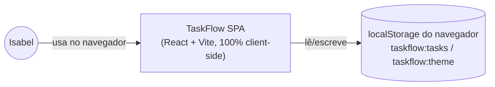
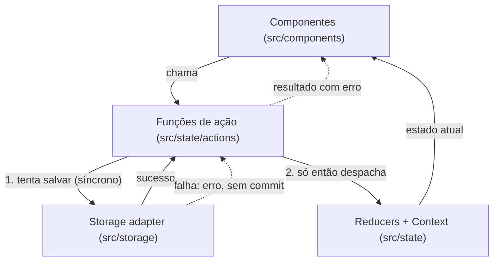
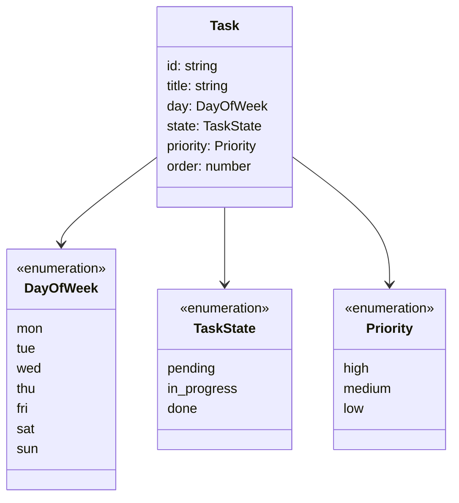

# Architecture Spine — TaskFlow

## Design Paradigm

TaskFlow é uma SPA (Single Page Application) **100% client-side** — sem backend, sem servidor, sem infraestrutura própria. Roda inteira no navegador de Isabel; o único "armazenamento remoto" é o `localStorage` do próprio navegador.

Dentro do cliente, o fluxo de dados é **unidirecional estilo Flux** (Ação → Reducer → Estado → View), com uma variação deliberada: as ações não são despachadas cruamente pelos componentes. Elas passam por uma **camada de comandos guardada por persistência** — funções de ação (`useTaskActions`, `useThemeActions`) que primeiro tentam persistir a mudança em `localStorage` e só então committam o novo estado ao React. Isso torna a consistência entre estado em memória e dados salvos uma propriedade estrutural, não uma convenção que cada tela precisa lembrar de seguir (ver AD-4).

Mapeamento de camadas → diretórios:

| Camada | Papel | Diretório |
| --- | --- | --- |
| UI (View) | Renderiza estado, chama funções de ação, nunca muta estado nem toca storage diretamente | `src/components/` |
| Comandos (Action layer) | Funções que validam, tentam persistir, e só então committam ao estado; único ponto que decide "sucesso ou erro" de uma mutação | `src/state/actions/` |
| Estado (Domain) | Reducers puros + Contexts (`TaskContext`, `ThemeContext`); fonte única de verdade em memória | `src/state/` |
| Persistência (Storage adapter) | Único código que toca `window.localStorage`; serialização, schema version, tratamento de erro de escrita | `src/storage/` |



## Invariants & Rules

### AD-1 — Sem backend, sem infraestrutura própria [ADOPTED]

- **Binds:** all
- **Prevents:** introduzir servidor, API própria, banco de dados remoto, CI/CD ou provedor de nuvem sem necessidade concreta do MVP.
- **Rule:** todo o comportamento do MVP é implementado no cliente (navegador). Nenhum FR do MVP exige um servidor — se uma história futura parecer exigir um, isso é um sinal de escopo saindo do MVP definido no PRD, e deve ser discutido antes de implementado, não decidido silenciosamente na hora de codar.

### AD-2 — Persistência via `localStorage`, duas chaves independentes

- **Binds:** NFR persistência (PRD §5), tema (EXPERIENCE.md Foundation)
- **Prevents:** um mecanismo de storage por feature (ex. tarefas em IndexedDB e tema em cookie), uma única chave acoplando dois domínios que mudam por gatilhos diferentes, ou dois módulos assumindo formatos diferentes para a mesma chave.
- **Rule:** tarefas e tema são domínios de persistência independentes, cada um com sua própria chave e seu próprio formato — nunca misturados:
  - `taskflow:tasks` — sempre `JSON.stringify`/`JSON.parse` de `{ schemaVersion: number, tasks: Task[] }`. Só `loadTasks`/`saveTasks` tocam essa chave.
  - `taskflow:theme` — sempre uma **string crua** (`'light'` ou `'dark'`), nunca `JSON.stringify`/`JSON.parse`. Só `loadTheme`/`saveTheme` tocam essa chave.
  - `schemaVersion` existe para permitir migração futura do formato salvo sem precisar redesenhar a persistência.
  - **Carregamento inicial (`loadTasks`/`loadTheme`):** chave ausente (primeira instalação) → estado vazio padrão (`{ schemaVersion: CURRENT, tasks: [] }` / `'light'`), sem erro. Chave presente mas ilegível (`getItem` lança, `JSON.parse` falha, ou `schemaVersion` não reconhecido) → **também** cai no estado vazio padrão, mas sinaliza um `loadError` que a UI mostra **uma vez**, na abertura ("Não foi possível carregar as tarefas salvas — começando do zero."), distinto do aviso permanente do AD-3. Nunca lança exceção não tratada na inicialização do app.
  - Tema padrão no primeiro uso (chave ausente) é sempre `'light'` — nunca derivado de `prefers-color-scheme` (EXPERIENCE.md proíbe seguir o SO).

### AD-3 — Mitigação do risco de perda de dados: aviso, não backup

- **Binds:** NFR persistência (PRD §5, Open Question 5)
- **Prevents:** adicionar uma funcionalidade de exportar/importar dados não pedida no PRD, ou ignorar o risco silenciosamente sem tratar.
- **Rule:** a interface exibe um aviso estático e discreto informando que os dados ficam salvos apenas neste navegador/computador. Nenhum mecanismo de backup/exportação é implementado no MVP — decisão explícita de Isabel, revisitável se o uso real mostrar perda de dados recorrente (ver Deferred).

### AD-4 — Persistência e commit de estado são atômicos

- **Binds:** FR-1, FR-2, FR-3, FR-4, FR-6 (**toda** mutação de tarefa — criar, editar, excluir, mudar estado, reordenar/mudar prioridade ou dia por arraste **ou** pelo Modal — sem exceção de caminho); tema
- **Prevents:** estado em memória e dados salvos divergirem; retry silencioso escondendo falhas; perda do que a usuária digitou quando salvar falha; um caminho de mutação (ex. arraste) contornando o guard porque só CRUD-via-modal foi lembrado.
- **Rule:** uma função de ação (`useTaskActions`/`useThemeActions`) primeiro tenta a escrita síncrona em `localStorage` (`try/catch`). Só em caso de sucesso ela despacha a mudança para o reducer/Context. Em caso de falha, o estado React **não muda**, e a função de ação retorna um resultado de erro para quem a chamou. No Modal de Tarefa, isso significa: o modal continua aberto, mostra uma mensagem de erro inline, preserva os campos já preenchidos, e oferece tentar novamente ou cancelar — nunca uma nova tentativa automática e silenciosa. **Nenhum outro caminho de mutação chama o reducer diretamente** — o drop handler do drag-and-drop chama a mesma `useTaskActions.reorderTask`/`moveTaskToDay` que o Modal chamaria, nunca um `dispatch` próprio.
  - **Formato de retorno único, sem exceções para a UI:** toda função de `useTaskActions`/`useThemeActions` retorna sempre `{ ok: true, task }` (ou `{ ok: true }`) em sucesso, ou `{ ok: false, error: { message: string } }` em falha — nunca lança (`throw`) para quem chamou. O `try/catch` da escrita fica interno à função de ação/ao storage adapter. Toda UI trata o resultado por essa forma (`if (!result.ok) ...`), nunca por `try/catch` ao redor da chamada.

### AD-5 — Gerenciamento de estado: React nativo, sem biblioteca externa

- **Binds:** all (estado da aplicação)
- **Prevents:** introduzir Redux/Zustand/outra lib de estado para um volume de dados (lista pessoal de uma usuária) que não justifica a camada extra.
- **Rule:** o estado vive em `useReducer` + `Context` do próprio React — um par (`tasksReducer`/`TaskContext`) para tarefas, outro (`themeReducer`/`ThemeContext`) para tema. Nenhuma dependência de state management externa entra no MVP sem justificativa concreta revisitada nesta spine.

### AD-6 — Arraste (drag-and-drop) sempre com equivalente completo por teclado

- **Binds:** FR-6 (ordenar por prioridade), EXPERIENCE.md Accessibility Floor
- **Prevents:** duas implementações de interação divergentes (uma lógica para mouse via arraste, outra hand-rolled para teclado) que podem dessincronizar.
- **Rule:** toda reordenação/mudança de prioridade/dia por arraste usa `@dnd-kit/react` (+ `@dnd-kit/dom`, `@dnd-kit/helpers`), cujo sensor de teclado embutido é a *mesma* lógica de interação usada pelo mouse — não uma reimplementação paralela. O Modal de Tarefa continua sendo a via alternativa completa a qualquer mudança de prioridade/dia (EXPERIENCE.md Interaction Primitives), como caminho totalmente independente do drag-and-drop, mas ambos terminam na mesma função de ação (AD-4, AD-7).
- **Risco aceito:** `@dnd-kit/react` está em `0.5.0`, pré-1.0, com API ainda sujeita a mudanças segundo os próprios mantenedores. Aceito porque é a opção acessível (teclado nativo) mais madura disponível hoje; se uma quebra de API bloquear a implementação, fixar a versão exata (sem `^`) no `package.json` e reavaliar aqui antes de atualizar.

### AD-7 — Ordem manual dentro do mesmo nível de prioridade

- **Binds:** FR-2 (mudar prioridade/dia pelo Modal), FR-6, PRD Open Question 3
- **Prevents:** dois componentes assumindo esquemas de ordenação incompatíveis (ex. um usando ordem global da tarefa, outro ordem por dia); o caminho do arraste e o caminho do Modal recalculando `order` de formas diferentes e produzindo valores duplicados no mesmo grupo.
- **Rule:** cada Tarefa tem um campo `order` (inteiro), com escopo `(day, priorityGroup)` — `priorityGroup` inclui os 4 grupos de exibição do FR-6 (Alta/Média/Baixa/sem prioridade). **Uma única função pura** (`reorderWithinGroup`, em `src/state/`) recalcula o `order` do(s) grupo(s) afetado(s) sempre que a Prioridade ou o Dia de uma Tarefa muda — **por qualquer caminho**: arraste (AD-6) ou edição pelo Modal (FR-2). Nenhum dos dois caminhos reimplementa a lógica de reindexação por conta própria; ambos chamam essa mesma função através de `useTaskActions`. Reindexação é sequencial simples (sem índice fracionário — volume de tarefas por dia é pequeno demais para justificar essa complexidade). Uma tarefa recém-criada recebe `order` = último do seu grupo (fim da fila), o que satisfaz "ordem de criação" como comportamento padrão até uma reordenação manual (PRD Open Question 3).

### AD-8 — Limites de camada: só o storage adapter toca `localStorage`

- **Binds:** all
- **Prevents:** componentes de UI lendo/escrevendo `localStorage` diretamente, tornando impossível trocar ou testar a persistência sem reescrever telas.
- **Rule:** `src/components/` e `src/state/` nunca importam `window.localStorage` diretamente. Toda leitura/escrita passa por `src/storage/` (`loadTasks`, `saveTasks`, `loadTheme`, `saveTheme`).



### AD-9 — Estilo e tema: CSS Modules + tokens em CSS custom properties, alternados por atributo

- **Binds:** DESIGN.md (paleta, tipografia, espaçamento, componentes), EXPERIENCE.md Foundation (tema instantâneo, sem seguir o SO)
- **Prevents:** cada componente escolher sua própria forma de estilizar (um com CSS-in-JS, outro com estilos inline) e divergir de `DESIGN.md`; trocar de tema via re-render de props em vez de uma alternância instantânea; o tema seguir `prefers-color-scheme` por engano.
- **Rule:** os tokens de `DESIGN.md` (`colors`, `typography`, `rounded`, `spacing`) são declarados uma vez como CSS custom properties num arquivo global `src/styles/tokens.css`; os valores `-dark` de `DESIGN.md` redefinem essas mesmas variáveis sob o seletor `:root[data-theme="dark"]`. `ThemeContext` só faz uma coisa no DOM: setar `document.documentElement.dataset.theme` (`'light'` ou `'dark'`) — a troca visual é 100% CSS, sem re-render de estilos via JS. Cada componente usa um CSS Module colocalizado (`TaskCard.module.css`, etc.) que referencia essas custom properties (`var(--color-accent)`, etc.) — nenhuma biblioteca de CSS-in-JS/Tailwind é adicionada (Vite já suporta CSS Modules nativamente, zero dependência nova).

## Consistency Conventions

| Concern | Convention |
| --- | --- |
| Naming (entidades, arquivos, tipos) | `Task`, `DayOfWeek` (`'mon'..'sun'`, semana começa segunda — PRD §3), `TaskState` (`'pending' \| 'in_progress' \| 'done'`), `Priority` (`'high' \| 'medium' \| 'low'`, ausência = `null`, nunca string vazia). Componentes em PascalCase (`TaskCard.tsx`); hooks/funções de ação em camelCase com prefixo `use` quando expõem estado/comportamento (`useTaskActions`). |
| Dados & formatos | IDs de tarefa via `crypto.randomUUID()` (API nativa do navegador — sem lib de UUID). Envelope persistido de tarefas inclui `schemaVersion` (número) para migração futura. Data de "hoje" calculada via `Date` local do navegador, sem fuso horário explícito (usuária única, uso local). Erro de persistência representado como `{ message: string }` simples — não há API remota que justifique um formato de erro mais estruturado. |
| Estado & cross-cutting | Toda mutação de tarefa/tema passa pelas funções de ação (`useTaskActions`/`useThemeActions`) — nunca `dispatch` cru a partir de um componente. Persistência é síncrona e antecede o commit ao estado React (AD-4). Sem autenticação/autorização — todas as tarefas pertencem implicitamente à única usuária da instalação (PRD §5). |
| Testes | Colocalizados com o arquivo testado (`TaskCard.test.tsx` ao lado de `TaskCard.tsx`), rodados via Vitest configurado em `vite.config.ts` (campo `test`). Prioridade de cobertura no MVP: `src/state/` (reducers, `reorderWithinGroup`, seletores) e `src/storage/` (load/save, incluindo os caminhos de falha do AD-2/AD-4) — a lógica sem UI é a mais barata de testar e a que este spine mais depende para estar certa. |

## Stack

| Name | Version |
| --- | --- |
| Node.js | ≥ 22.12 (piso exigido por Vite 8 / Vitest 5) |
| React + react-dom | 19.3.0 |
| Vite | 8.2.2 |
| @vitejs/plugin-react | 6.1.1 |
| TypeScript | **6.0.x** — não a 7.0 (ver decisão abaixo) |
| @dnd-kit/react + @dnd-kit/dom + @dnd-kit/helpers | 0.5.0 (sucessor moderno recomendado; `@dnd-kit/core` é considerado legado, sem atualização há ~2 anos; ver risco aceito em AD-6) |
| Vitest | 5.0.0 |
| @testing-library/react | 16.3.3 |
| @testing-library/dom | 10.4.1 (peer dependency obrigatória de `@testing-library/react`; **correção pós-Story 1.1** — a linha original desta tabela citava `16.3.3` para os dois pacotes, mas `@testing-library/dom` nunca teve uma série 16.x publicada e `@testing-library/react@16.3.3` declara `^10.0.0` como peer — números de dois pacotes distintos haviam sido conflados) |

*Versões verificadas na web em 2026-09-10; a busca original desta spine havia citado Vite 8.1.3 (defasado por um patch já no dia da verificação) — números de patch/minor driftam rápido e devem ser reconferidos no `npm install` real; é o código, não esta spine, quem passa a ser dono deles a partir daí.*

**Decisão TypeScript 6.0, não 7.0:** TypeScript 7.0 (jul/2026) reescreveu o compilador nativamente em Go e **não** ficou compatível com a API programática de compilador que `typescript-eslint` usa — `typescript-eslint` declara suporte só a TypeScript `<6.1.0` e fechou o pedido de suporte ao 7.0 como "not planned"; o mesmo atinge `ts-jest`, `ts-morph` e o modo `--typecheck` do Vitest. TypeScript 6.0 ainda está dentro dessa faixa suportada e evita a quebra de ferramental documentada — favorece "tecnologia enfadonha" (boring technology) sobre a versão mais nova, consistente com o tamanho e o propósito de aprendizado deste projeto. Revisitar quando o ecossistema (`typescript-eslint` etc.) adotar o 7.0.

## Structural Seed

```text
taskflow/
  src/
    components/     # WeekView, DayColumn, TaskCard, TaskModal, PriorityTag, StateIndicator, ThemeToggle, Header
    state/
      actions/       # useTaskActions, useThemeActions (camada de comandos guardada por persistência — AD-4)
      selectors.ts    # sortTasksInDay (FR-6: Alta→Média→Baixa→sem prioridade, depois `order`)
      reorderWithinGroup.ts  # função pura única de reindexação de `order` (AD-7) — chamada por drag e Modal
      TaskContext.tsx
      ThemeContext.tsx
      tasksReducer.ts
      themeReducer.ts
    storage/         # loadTasks/saveTasks/loadTheme/saveTheme — único lugar que toca localStorage (AD-2, AD-8)
    styles/
      tokens.css      # custom properties de DESIGN.md, redefinidas sob :root[data-theme="dark"] (AD-9)
    types/           # Task, DayOfWeek, TaskState, Priority
    App.tsx
    main.tsx
  index.html
  vite.config.ts
  package.json
```



**Deploy & ambiente:** só desenvolvimento local, via `npm run dev` (Vite) em `localhost`. Sem build de produção fixado, sem hospedagem, sem CI/CD — decisão explícita de Isabel, proporcional a um app de uso pessoal num único computador (ver Deferred se isso mudar).

**Operação/observabilidade:** nenhuma — sem telemetria, sem logging remoto, sem monitoramento. Não há usuário além de Isabel nem serviço rodando para operar; erros de persistência são tratados na própria UI (AD-4), não reportados a lugar nenhum externo.

**Carregamento inicial (EXPERIENCE.md State Patterns):** não há estado de carregamento visível. A leitura de `localStorage` é síncrona — as 7 colunas já aparecem preenchidas na primeira renderização, fechando a nota `[NOTE FOR ARCHITECTURE]` do EXPERIENCE.md sobre latência perceptível: não existe, dado o mecanismo escolhido (AD-2).

## Capability → Architecture Map

| Capability | Lives in | Governed by |
| --- | --- | --- |
| FR-1 Criar tarefa | `TaskModal` (modo criação) → `useTaskActions.createTask` → `storage` | AD-4, AD-5, AD-7, AD-8 |
| FR-2 Editar tarefa | `TaskModal` (modo edição) → `useTaskActions.updateTask` → `storage` | AD-4, AD-5, AD-8 |
| FR-3 Excluir tarefa | `TaskModal` (confirmação) → `useTaskActions.deleteTask` → `storage` | AD-4, AD-5, AD-8 |
| FR-4 Alterar estado | `TaskCard`/`StateIndicator` (clique cicla estado) → `useTaskActions.cycleState` → `storage` | AD-4, AD-5, AD-8 |
| FR-5 Visualizar semana | `WeekView`, `DayColumn` (leem `TaskContext`) | AD-5 |
| FR-6 Ordenar/sinalizar prioridade | `selectors.sortTasksInDay`, `PriorityTag`, arraste via `@dnd-kit/react` → `useTaskActions.reorderTask`/`moveTaskToDay` → `storage` | AD-4, AD-6, AD-7, AD-8 |
| FR-7 Diferenciar tarefa concluída | `TaskCard` (estilo visual — ver `DESIGN.md`/`task-card.completed-opacity`) | AD-9; consequência de FR-4 + `DESIGN.md` |
| NFR Persistência (PRD §5) | `storage/` (`taskflow:tasks`) | AD-2, AD-3, AD-4 |
| Tema claro/escuro persistente (EXPERIENCE.md Foundation) | `ThemeContext` + `storage/` (`taskflow:theme`) | AD-2, AD-4, AD-5, AD-9 |
| Estilo visual / tokens (`DESIGN.md`) | `src/styles/tokens.css` + CSS Modules por componente | AD-9 |

## Deferred

- **Exportar/Importar dados (backup manual).** Avaliado como mitigação possível ao risco de perda de dados (PRD Open Question 5) e descartado para o MVP por decisão explícita de Isabel — o aviso na interface (AD-3) é a mitigação escolhida. Revisitar se o uso real mostrar perda de dados recorrente, não hipotética.
- **Build de produção / hospedagem.** MVP roda só via servidor de dev local (ver Structural Seed). Revisitar somente se Isabel quiser acessar o TaskFlow de outro lugar — nesse ponto o Brief já aponta que isso vem junto com login/multi-dispositivo (v2), não antes.
- **Largura mínima de janela / comportamento abaixo do limiar.** EXPERIENCE.md (Responsive & Platform) deixa em aberto se a grade de 7 colunas deve fazer scroll horizontal ou colunas mais estreitas abaixo de uma largura "razoável". É uma decisão de CSS/implementação, não estrutural — não bloqueia esta spine; resolver na etapa de build/histórias.
- **Cadastro/login, multi-dispositivo, notificações/lembretes.** Fora do MVP por decisão do PRD (§6 Non-Goals, §7.2), não desta arquitetura — mantidos aqui só para registrar que, se algum dia entrarem, provavelmente invalidam AD-1 (sem backend) e precisam de uma nova spine, não uma extensão desta.
